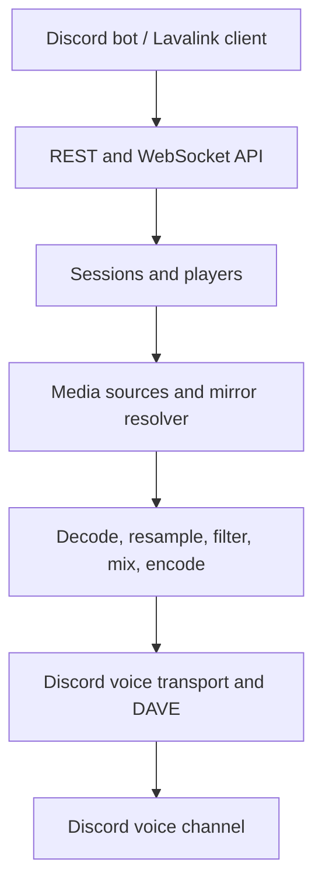

<div align="center">

# KizunaLink

### Your Discord audio stack. Native Rust. No JVM.

A standalone audio node designed for **Lavalink v4 clients**, with integrated media sources, DSP filters, lyrics, and Discord DAVE encryption.

[](https://github.com/codexdevsnik/Kizunalink/actions/workflows/ci.yml)
[](https://github.com/codexdevsnik/Kizunalink/releases)
[](https://www.rust-lang.org/)
[](https://lavalink.dev/api/)
[](./LICENSE)

[Quick start](#quick-start) · [Features](#features) · [Architecture](#architecture) · [Configuration](#configuration) · [Bot integration](#bot-integration) · [API](#rest-and-websocket-api) · [Development](#development)

</div>

---

## Overview

KizunaLink resolves media, decodes and processes audio, encodes Opus, and sends encrypted voice packets to Discord. Your bot handles commands and queues; the node handles audio.

Built with **Tokio**, **Axum**, **Symphonia**, and **libopus**, it brings a native runtime and an integrated feature set to the Lavalink-style deployment model.

> [!IMPORTANT]
> **Production hardening is in progress.** The work is tracked in [PR #5](https://github.com/codexdevsnik/Kizunalink/pull/5) on `hardening/production-readiness`. Successful CI checks do not establish complete client compatibility, source availability, or production readiness. Validate your workload before migration; keep a rollback path for critical bots.

## Features

| Capability | What KizunaLink provides |
|---|---|
| Native runtime | A Rust server binary without a JVM or garbage collector |
| Client-facing API | Lavalink v4-style REST control and WebSocket events |
| Audio processing | Decoding, stereo resampling, DSP, mixing, and Opus encoding |
| Discord voice | Voice gateway transport, RTP encryption, and DAVE integration through the patched `davey` crate |
| Media resolution | Integrated sources and metadata-to-audio mirror matching |
| Lyrics | Concurrent providers with synced and unsynced results |
| SponsorBlock | Segment lookup, automatic skipping, and events |
| Operations | Health probe, authenticated Prometheus metrics, TLS configuration, and per-IP rate limiting |
| Sessions | Resumption support and bounded event queues |

### Audio engine

| Component | Purpose |
|---|---|
| Symphonia decoding | Demux and decode supported media formats |
| Resampling | Convert audio to 48 kHz stereo with selectable quality |
| Equalizer | 15-band frequency shaping |
| Timescale | Tempo and pitch processing |
| Karaoke | Center-channel cancellation |
| Reverb | Reverberation effect |
| Echo | Delayed repeats |
| Chorus | Modulated layered effect |
| Flanger | Short modulated delay |
| Phaser | Phase-shift effect |
| Tremolo | Amplitude modulation |
| Vibrato | Pitch modulation |
| Rotation | Rotating stereo effect |
| Distortion | Nonlinear processing |
| Compressor | Dynamic-range control |
| Low-pass | Attenuate high frequencies |
| High-pass | Attenuate low frequencies |
| Normalization | Level adjustment |
| Spatial audio | 3D audio processing |
| Phonograph | Vinyl-style effect |
| Buffer pooling | Reuse audio buffers to reduce allocation pressure |
| Soft limiting and ramps | Manage peaks and playback transitions |

### Media sources

The source implementations below are part of the project. **An implemented source is not a guarantee of current upstream availability.** Authentication, geography, account access, and provider changes can affect resolution or playback.

| Source | Source | Source |
|---|---|---|
| YouTube | Spotify | Deezer |
| Apple Music | SoundCloud | Tidal |
| JioSaavn | Gaana | Mixcloud |
| NetEase | VK Music | Yandex Music |
| Audiomack | Audius | Twitch |
| Reddit | HTTP URLs | Local files |

Metadata-only results may require a playable mirror. See [config.example.toml](./config.example.toml) for source settings and resolver priorities.

## Quick start

The commands below use the **hardening branch** so the configuration and build match this README. For a tagged release, use the matching tag and configuration instead.

### 1. Get the project

```bash
git clone --branch hardening/production-readiness https://github.com/codexdevsnik/Kizunalink.git
cd Kizunalink
cp config.example.toml config.toml
```

### 2. Configure authentication

Edit `config.toml` before starting:

```toml
[server]
address = "127.0.0.1"
port = 2333
authorization = "replace-with-your-own-long-random-secret"
```

Replace the placeholder with a real secret. There is **no default**: the server
refuses to start if `authorization` is missing, empty, or a known placeholder
(such as `youshallnotpass`), on **every** bind address including loopback. For
Docker, use `address = "0.0.0.0"` inside the container and a strong authorization
value, and prefer injecting it via `KIZUNA_AUTHORIZATION` rather than the file.

> [!WARNING]
> The Compose file binds `2333` to loopback on the host and requires
> `KIZUNA_AUTHORIZATION`. To expose the node, put a TLS-terminating reverse proxy
> in front — the proxy is not a substitute for the secret. Do not expose an
> unprotected node, commit credentials, or enable HTTP/local-file sources for
> untrusted clients without reviewing their access boundaries.

### 3. Choose a runtime

#### Docker Compose

```bash
docker compose up -d --build
docker compose logs --tail=100 kizunalink
curl --fail --silent --show-error http://127.0.0.1:2333/health

# Stop the service
docker compose down
```

The Compose setup mounts `config.toml` read-only, persists logs in a named volume, and uses a read-only container root filesystem.

#### Build from source

Install a stable Rust toolchain and native build dependencies. On Debian/Ubuntu:

```bash
sudo apt-get update
sudo apt-get install -y build-essential cmake pkg-config clang libclang-dev perl libopus-dev

export LIBOPUS_STATIC=1 OPUS_STATIC=1
cargo build --release --workspace --locked
./target/release/kizuna-server
```

#### Pre-built binaries

Check the [releases page](https://github.com/codexdevsnik/Kizunalink/releases) for available platform assets. Release binaries may not include unmerged hardening work. Use the configuration corresponding to the downloaded release; do not assume every architecture has a published asset.

### 4. Verify the API

In another terminal, set `KIZUNA_AUTHORIZATION` to the same secret using your preferred secure environment-management method, then run:

```bash
curl --fail --silent --show-error \
  -H "Authorization: ${KIZUNA_AUTHORIZATION:?Set the node secret first}" \
  http://127.0.0.1:2333/v4/info
```

A successful health probe checks liveness, not Discord connectivity or media-source availability.

## Configuration

Use [config.example.toml](./config.example.toml) as the complete reference. By default, the server reads `config.toml` from its working directory, falling back to the example configuration. `KIZUNA_CONFIG_PATH` selects an explicit configuration path.

| Environment variable | Setting |
|---|---|
| `KIZUNA_CONFIG_PATH` | Configuration file path |
| `KIZUNA_ADDRESS` | `server.address` |
| `KIZUNA_PORT` | `server.port` |
| `KIZUNA_AUTHORIZATION` | `server.authorization` |
| `KIZUNA_RATE_LIMIT_PER_MINUTE` | `server.rate_limit_per_minute` |
| `KIZUNA_LOG_LEVEL` | `logging.level` |
| `KIZUNA_TLS_ENABLED` | `server.tls.enabled` |
| `KIZUNA_METRICS_ENABLED` | `metrics.prometheus.enabled` |

### Authorization (required)

`server.authorization` is the shared secret every REST and WebSocket client must
send. There is **no default**. Startup fails, with a message that never echoes the
secret, if the value is:

- missing or empty,
- only whitespace, or
- a known placeholder such as `youshallnotpass`, `password`, `changeme`,
  `secret`, or the example values `replace-with-your-strong-secret` /
  `replace-with-your-own-long-random-secret`.

This applies on **every** bind address, including `127.0.0.1`: a guessable
credential is reachable by any local process or container port-forward, so it is
never safe.

Prefer injecting the secret from the environment (a Docker/Kubernetes secret) so
it never lands in `config.toml`:

```bash
export KIZUNA_AUTHORIZATION="$(openssl rand -hex 32)"
```

An empty `KIZUNA_AUTHORIZATION` is a hard error rather than a silent fallback:
the secret can never be accidentally cleared by an exported-but-empty variable.

### Reverse proxy and network exposure

Put KizunaLink behind a TLS-terminating reverse proxy (Caddy, nginx, Traefik)
and terminate HTTPS/WSS there, or enable `server.tls` to serve TLS directly.

A reverse proxy is **not** a substitute for the authorization secret:

- Bind the backend to a private address (`127.0.0.1`, a private interface, or a
  container network) so the node's port is not directly reachable, and always set
  a strong `server.authorization`.
- If the proxy adds or strips authentication, it must preserve the
  `Authorization` header end-to-end (or inject the node's secret itself), and it
  must not forward client-supplied `Authorization` values unfiltered.
- `/health` is unauthenticated by design (for orchestrator probes). Do not expose
  it to the public internet; restrict it at the proxy or bind locally.

### Source access and regional routing

| Situation | Guidance |
|---|---|
| YouTube blocks datacenter egress | Configure `sources.youtube.proxy` where appropriate. Proxy-aware handling includes OAuth refresh and media fetching; credentials do not guarantee upstream access. |
| Indian catalogs | Consider `jssearch:` for JioSaavn or `gnsearch:` for Gaana, subject to provider availability. |
| JioSaavn/Gaana mirrors | Use query-based matching; bare ISRC identifiers are not reliable searches for these providers. |
| SoundCloud authorization failures | Inspect the returned source error; authentication/token delivery can change upstream. |
| Account-dependent providers | Supply required credentials securely or disable the provider. |

## Bot integration

Configure a Lavalink v4 client with the node's host, port, authorization secret, and TLS setting. Libraries such as Wavelink and `lavalink-client` are intended integration targets; this is **not** a certification of every client version.

### Python: Wavelink connection snippet

Call this from your bot's initialization flow after creating the Discord client. `bot` is your existing bot instance; the snippet is not a complete bot.

```python
import os
import wavelink

async def connect_audio_node(bot):
    password = os.environ.get("KIZUNA_AUTHORIZATION")
    if not password:
        raise RuntimeError("KIZUNA_AUTHORIZATION must be set")
    node = wavelink.Node(
        uri=os.environ.get("KIZUNA_NODE_URI", "http://127.0.0.1:2333"),
        password=password,
    )
    await wavelink.Pool.connect(nodes=[node], client=bot)
```

### JavaScript / TypeScript: node settings

Use these settings in your client's node configuration; your bot must also provide its Discord identity and gateway forwarding according to the client library's documentation.

```typescript
const authorization = process.env.KIZUNA_AUTHORIZATION;
if (!authorization) {
  throw new Error("KIZUNA_AUTHORIZATION must be set");
}

const node = {
  host: "127.0.0.1",
  port: 2333,
  authorization,
  secure: false,
};
```

Real voice integrations must provide a valid Discord `User-Id`. DAVE readiness and successful source loading should be checked separately from the WebSocket handshake.

## Architecture



| Location | Responsibility |
|---|---|
| `kizuna-server/` | API, sessions, monitoring, and server lifecycle |
| `kizunalink/kizuna-voice/` | Audio engine, media, configuration, and Discord transport |
| `vendor/davey/` | Patched DAVE dependency |

## REST and WebSocket API

`/v4/*` and enabled metrics require the `Authorization` header. `/health` is unauthenticated. The metrics path is configurable.

| Method | Endpoint | Purpose |
|---|---|---|
| `GET` | `/health` | Liveness probe |
| `GET` | `/v4/info` | Version, sources, and filters |
| `GET` | `/v4/stats` | Node statistics |
| `GET` | `/v4/loadtracks?identifier=` | Search or resolve a track |
| `GET` | `/v4/loadsearch?identifier=` | Search extension |
| `GET` | `/v4/decodetrack?encodedTrack=` | Decode one track |
| `POST` | `/v4/decodetracks` | Decode multiple tracks |
| `GET` | `/v4/sessions/{session}/players` | List players |
| `PATCH` | `/v4/sessions/{session}/players/{guild}` | Update playback and filters |
| `DELETE` | `/v4/sessions/{session}/players/{guild}` | Destroy a player |
| `GET` | `/v4/lyrics?track=` | Lyrics extension |
| `WS` | `/v4/websocket` | Session events |
| `GET` | `/metrics` | Default Prometheus endpoint, when enabled |

For load results, `empty` means no match and `error` means loading failed. `loadFailed` is a track-end event reason, **not** a `loadType`.

## KizunaLink and Lavalink

KizunaLink is an alternative implementation, not the official Lavalink server.

| Area | KizunaLink | Lavalink |
|---|---|---|
| Runtime | Native Rust | Java 17+ |
| DAVE | Integrated through patched `davey` | Officially supported |
| Extensions | Integrated sources, DSP, lyrics, and SponsorBlock | Built-in functionality plus a plugin ecosystem |
| Maturity | Production-hardening work in progress | Established production usage and client ecosystem |

A native runtime avoids garbage collection, but does not guarantee lower jitter, lower CPU use, or better audio quality. Memory and startup comparisons require the same hardware, workload, versions, and configuration. No universal performance advantage is asserted here.

## Development

```bash
export LIBOPUS_STATIC=1 OPUS_STATIC=1
cargo fmt --all -- --check
cargo check --workspace --all-targets --locked
cargo clippy --workspace --all-targets --locked -- -D warnings
cargo test --workspace --all-targets --locked
cargo test --workspace --doc --locked
cargo test -p kizuna-server --locked -- --ignored soak --nocapture
cargo deny check advisories
cargo audit
cargo build --release --workspace --locked
```

Install `cargo-deny` and `cargo-audit` separately to run the advisory checks. Review [deny.toml](./deny.toml) and [.cargo/audit.toml](./.cargo/audit.toml): documented exceptions mean a successful advisory gate is not a claim of zero vulnerabilities.

Live source, Docker, and Discord/DAVE checks are separate from unit tests. Record the exact commit, commands, outcomes, and blocked prerequisites; never report credential-dependent or unexecuted checks as passed.

## Security and contributing

Report vulnerabilities according to [SECURITY.md](./SECURITY.md). Keep secrets out of commits, issue bodies, and logs.

For contributions, investigate existing behavior first, keep changes focused, and add regression tests for demonstrated defects. See [AGENTS.md](./AGENTS.md) for development notes and [the hardening PR](https://github.com/codexdevsnik/Kizunalink/pull/5) for the current review scope.

## License

Distributed under the [MIT License](./LICENSE).

---

<div align="center">

Made with care by [nikcodex](https://github.com/nikcodex).

[Back to top](#kizunalink)

</div>
